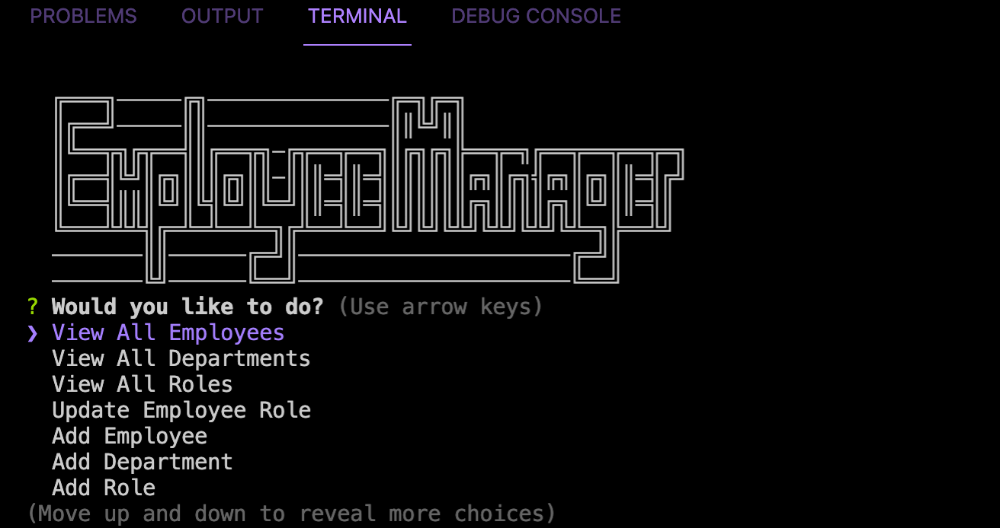

# MySQL Employee Tracker
  
## Description 
A Node CLI application that uses Inquirer and MySQL to view, add, and delete employee data.


  
  
## Installation

* First `git clone` this project
* Run `npm install` in order to install the npm package dependencies as specified in the `package.json`
* Create an `.env` file with your MySQL credentials:
```
DB_USER='root or your username'
DB_PW='your password'

```
* Use the MySQL CLI to load the data by running `mysql> source db/schema.sql` and `source db/seeds.sql`. Then enter `quit` to exit.
* Start the application by running `node server` in the command line


## Usage 
Watch the demo video:


[Link to video](https://drive.google.com/file/d/1WpvF1u3uWyVOxowiht7O1QOEmXkZgxQH/view)

## License
ISC

 
